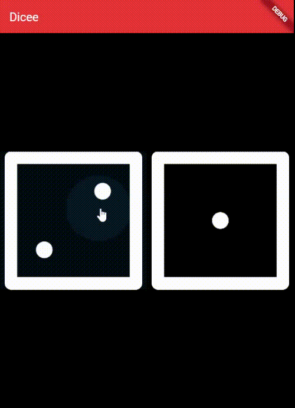

# flutter-03-Dicee

used various widgets like Container, Column, Row, Expanded, etc to develop a stateful Dice app.

## The App



## Notes

### 1. Expanded() widget
- it adjusts it's child a/c to the screen size.
- it's `flex` property will divide the children into ratio

### 2. Other way of using AssetImage()

`Image.asset('images/name.png')`

### 3. Deprecated widgets

- FlatButton => TextButton()
- RaisedButton => ElevatedButton()

## Different ways to make circle in flutter

1. using `CircleAvatar()` widget
```
CircleAvatar(
    radius: 50,
    child: Text('My Avatar'),
)
```

2. using `borderRadius:` property of Container widget
```
Container(
    decoration: BoxDecoration(
        borderRadius: BorderRadius.circular(100),
    ),
)
```

3.  Using `shape: BoxShape.circle` property 

```
Container(
  decoration: BoxDecoration(
    shape: BoxShape.circle,
  ),
)
```

4. Using the `CustomPaint` 
```
CustomPaint(
  painter: CirclePainter(),
)
```
<br><br>

# Let's build Stateful Apps

- whatever will change, is coded inside the `State` part of the stateful widget

- State part tracks and updates the screen as the state changes 

- `setState((){})` marks certain things dirty
> for eg: leftDice is getting changed inside setState(), so setState() will mark every part, wherever leftDice is used, as DIRTY

- `setState((){})` triggers/calls the build method and tells it that state has changed

- whenever hot reload is done, the `build()` method is called and it re-builds only those parts that are marked as DIRTY

- `Hot reload` is a feature of Flutter that allows to see the changes in code without having to rebuild the app. When a change is made to a `stateful widget`, the `dirty` flag will be set and the `build()` method will be called. This will cause the widget to be rebuilt and the changes will be reflected in the app.

-----

Run any Flutter repository on Zapp website: <a href="https://zapp.run/assets/homepage/import-github.gif">refer this link </a>

List of all Flutter apps: <a href="https://github.com/Rahullkumr/Flutter-Projects-List">click here</a>
